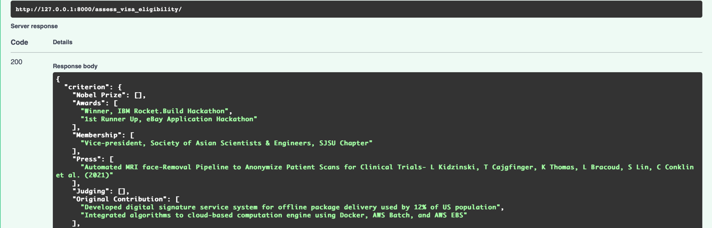
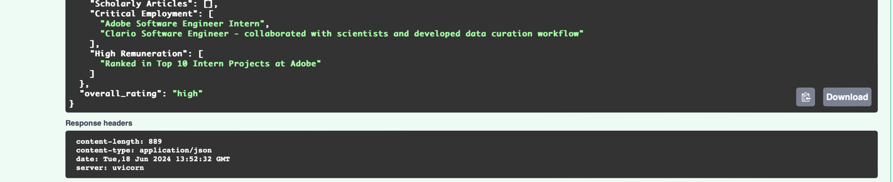

# Design Document

## Overview
This document outlines the design and implementation of an AI application to assess how a person is qualified for an O-1A Visa based on their CV. The application extracts information relevant to the O-1A visa categories, summarizes and deduplicates this information, and evaluates the person's qualification.
Functional Requirements
•	Input: A CV text.
•	Output:
1.	Extracted information categorized according to the O-1A visa criteria.
2.	An overall rating (high, medium, or low) on the chance that the person is qualified for an O-1A visa.

#### Result of uploading my resume

## How to run
1. set up an OpenAI API key as environment variable named `OPENAI_API_KEY`. The system uses OpenAI APIs to process documents, and therefore needs access to an OpenAI API key.
2. Navigate into `app` directory. Start the system by executing `fastapi dev main.py`.

## Rating Generation
Based on the rules outlined in on the USCIS website, the beneficiary has received a major internationally recognized award (such as the Nobel Prize) or at least three of the following forms of evidence, awards, membership, press, judging, original contribution, scholarly articles, critial employment, and high remuneration.
The system therefore assesses the CV against the following O-1A visa criteria:
1.	Nobel Prize
2.	Awards: Documentation of the beneficiary's receipt of nationally or internationally recognized prizes or awards for excellence in the field of endeavor.
3.	Membership: Documentation of the beneficiary's membership in associations in the field which require outstanding achievements of their members.
4.	Press: Published material in professional or major trade publications or major media about the beneficiary.
5.	Judging: Evidence of the beneficiary's participation as a judge of the work of others in the same or an allied field.
6.	Original Contribution: Evidence of the beneficiary's original contributions of major significance in the field.
7.	Scholarly Articles: Evidence of the beneficiary's authorship of scholarly articles in professional journals or other major media.
8.	Critical Employment: Evidence that the beneficiary has been employed in a critical or essential capacity for organizations with a distinguished reputation.
9.	High Remuneration: Evidence that the beneficiary has commanded or will command a high salary or other remuneration.
The system automatically gives a rating of high when Nobel Prize is rewarded to the beneficiary or when the person satisfy at least 3 categories, a rating of medium when the beneficiary satisfy exactly 3 categories, and a rating of low when the beneficuary satisfy less then 3 categories.
## System Design
### High-Level Architecture
1.	Input Handling: Receives the CV text.
2.	Information Extraction: Uses the OpenAI API to extract relevant information from the CV text based on the O-1A visa categories.
3.	Refinement and Deduplication: Refine the extracted information and removes duplicates.
4.	Evidence Counting: Counts the number of pieces of evidence in each category.
5.	Qualification Evaluation: Evaluates the overall qualification based on the counts.

### Modules and Functions

1. Input Handling
   - Handles the input CV text. 

2. Information Extraction 
   - Function: extract_information 
   - Description: Sends a detailed prompt to the OpenAI API to extract information based on the O-1A visa categories. 
   - Input: CV text. 
   - Output: Extracted information.

3. Refinement and Deduplication
   - Function: refine_information, evaluate_criteria 
   - Description: Splits the extracted information by periods, processes each segment, cleans the text, and removes duplicates. 
   - Input: Extracted information. 
   - Output: Deduplicated information.

4. Evidence Counting
   - Function: evaluate_criteria 
   - Description: Counts the number of pieces of evidence in each category from the previous step 
   - Input: Deduplicated information. 
   - Output: Counts of evidence in each category.

5. Qualification Evaluation
   - Function: evaluate_high_evidence 
   - Description: Evaluates count of categories with evidence and generate a rating 
   - Input: Counts of evidence in each category 
   - Output: Overall qualification rating (high, medium, or low).

### Design Considerations
Handling Large CV Texts 
- The system uses a sliding window approach to handle large CV texts, ensuring that the text length is within the model's limits.

Robustness
- The text cleaning step after obtaining each OpenAI API output ensures that leading and trailing spaces, numbers, and hyphens are removed to maintain the integrity of the extracted categories and information.

Deduplication
- The system calls the openAI API in the next step remove duplicates that may be resuled from the use of sliding window, ensuring that the summarized information is unique.

Flexibility
- The design is modular, allowing for easy updates and maintenance. Each function handles a specific task, promoting code reusability and readability.

### Conclusion
This design document outlines the structure and functionality of an AI-based system for assessing O-1A visa qualifications from a CV. The modular design, combined with robust text processing and evaluation methods, ensures accurate and reliable assessments, providing valuable insights for visa applicants and evaluators alike.
